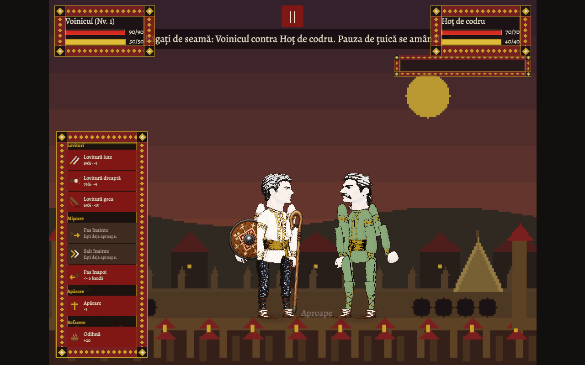
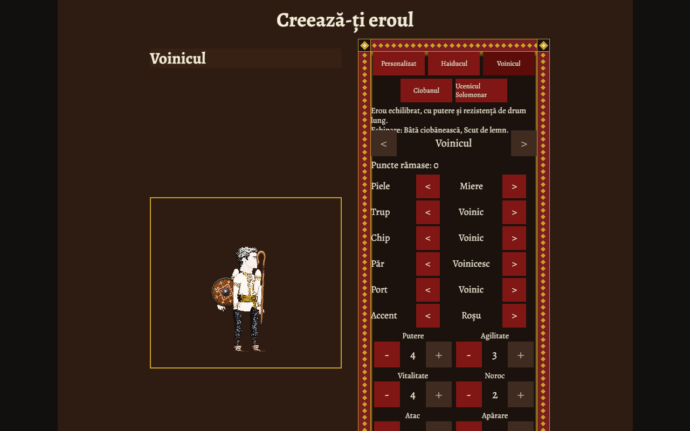
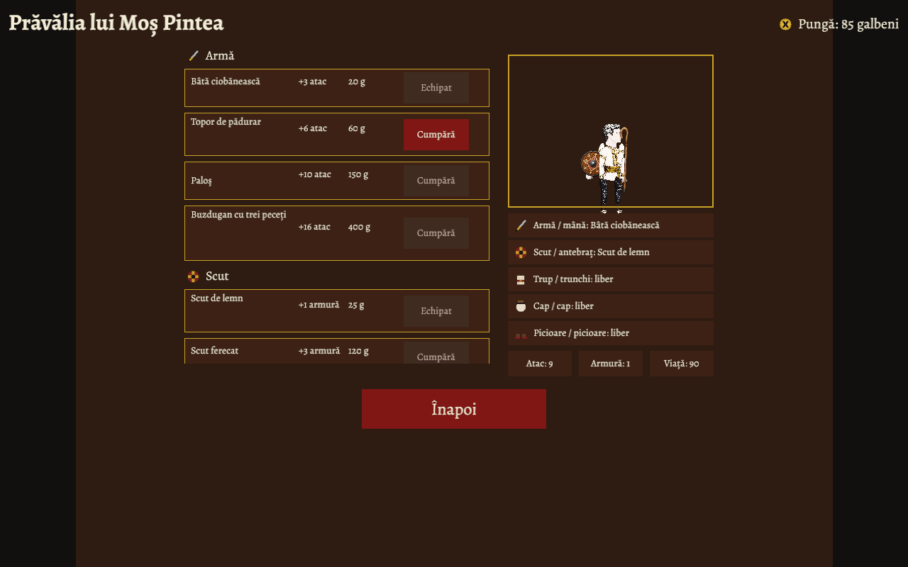

# Romanian Folk Fight

A browser-based, turn-based arena RPG in the spirit of *Swords and Sandals* —
remastered, and cast entirely from Romanian folklore.

[](https://github.com/lihor-hub/romanian-folk-fight/actions/workflows/ci.yml)
[](https://github.com/lihor-hub/romanian-folk-fight/actions/workflows/deploy.yml)
[](#license)
[](https://lihor-hub.github.io/romanian-folk-fight/)

Build your hero, step into the arena, and fight your way through strigoi,
vârcolaci, and zmei until you face Zmeul Zmeilor himself.



**Core loop:** fight → earn galbeni → buy gear at the prăvălie → level up →
fight a stronger foe. A boss awaits every 5 fights.

<details>
<summary>More screenshots: character creation and the shop</summary>

| Character creation | Shop (Prăvălia lui Moș Pintea) |
| --- | --- |
|  |  |

</details>

## Tech stack

- [Rust](https://www.rust-lang.org/) + [Bevy 0.19](https://bevy.org/) — ECS
  architecture, one plugin per feature.
- WebAssembly + WebGL2 via [Trunk](https://trunkrs.dev/) for the browser
  build; native builds for day-to-day development.

## Getting started

Prerequisites: [rustup](https://rustup.rs/) and (optional, for git hooks)
[pre-commit](https://pre-commit.com/).

```bash
git clone https://github.com/lihor-hub/romanian-folk-fight.git
cd romanian-folk-fight
scripts/bootstrap-worktree.sh   # verifies cargo, installs git hooks
```

### Run natively (fastest iteration)

```bash
cargo run --features dev
```

The `dev` feature enables Bevy dynamic linking for fast incremental builds.
Never enable it for release or wasm builds.

### Run in the browser

```bash
rustup target add wasm32-unknown-unknown
cargo install trunk        # or: brew install trunk
trunk serve                # serves on http://localhost:8080
```

`trunk build --release` produces a distributable bundle in `dist/`.

## Quality gates

CI enforces all of these on every PR; the pre-commit/pre-push hooks mirror
them locally:

```bash
cargo fmt --all -- --check
cargo clippy --all-targets -- -D warnings
cargo test
```

`cargo xtask pre-push` runs the full gate (the commands above, workspace-wide,
plus the native/release/wasm build matrix) in one step, and
`cargo xtask --help` lists the focused verification loops (`test logic`,
`test journey`, `check build-matrix`). The `cargo xtask` alias is generated by
`scripts/bootstrap-worktree.sh`; see `xtask/README.md` for the commands and
`docs/feedback-budgets.md` for their measured timings and target budgets.

## Roadmap

Development is organized into phased milestones — foundation, core loop,
combat, progression & economy, remastered presentation, web release, and
polish. See the
[milestones](https://github.com/lihor-hub/romanian-folk-fight/milestones) and
[issues](https://github.com/lihor-hub/romanian-folk-fight/issues) for the
full plan.

## Contributing

Contributions are welcome — code, art, folklore expertise, and playtesting
all help. Start with [CONTRIBUTING.md](CONTRIBUTING.md) for the workflow, and
please follow the [Code of Conduct](CODE_OF_CONDUCT.md); see
[SECURITY.md](SECURITY.md) to report a vulnerability privately.

We're especially looking for:

- Rust/Bevy code — gameplay systems, UI, tooling
- Art & audio in the folk-textile visual style (see `docs/art-direction.md`)
- Romanian folklore and language review (names, flavor text, announcer lines)
- Playtesting and game design feedback
- Documentation

Good places to start:

- [`good first issue`](https://github.com/lihor-hub/romanian-folk-fight/labels/good%20first%20issue) label
- [Welcome discussion](https://github.com/lihor-hub/romanian-folk-fight/discussions/350)
- [Design ideas thread](https://github.com/lihor-hub/romanian-folk-fight/discussions/351)
- [docs/ARCHITECTURE.md](docs/ARCHITECTURE.md) — a newcomer's tour of the codebase

## License

Dual-licensed under either:

- Apache License, Version 2.0 ([LICENSE-APACHE](LICENSE-APACHE) or <http://www.apache.org/licenses/LICENSE-2.0>)
- MIT license ([LICENSE-MIT](LICENSE-MIT) or <http://opensource.org/licenses/MIT>)

at your option.

Assets are licensed separately per-file; see [CREDITS.md](assets/CREDITS.md) for details.

## Automatic Scripts
For more details on running our asset collection pipelines, see our [Scripts Directory Index](scripts/README.md).

